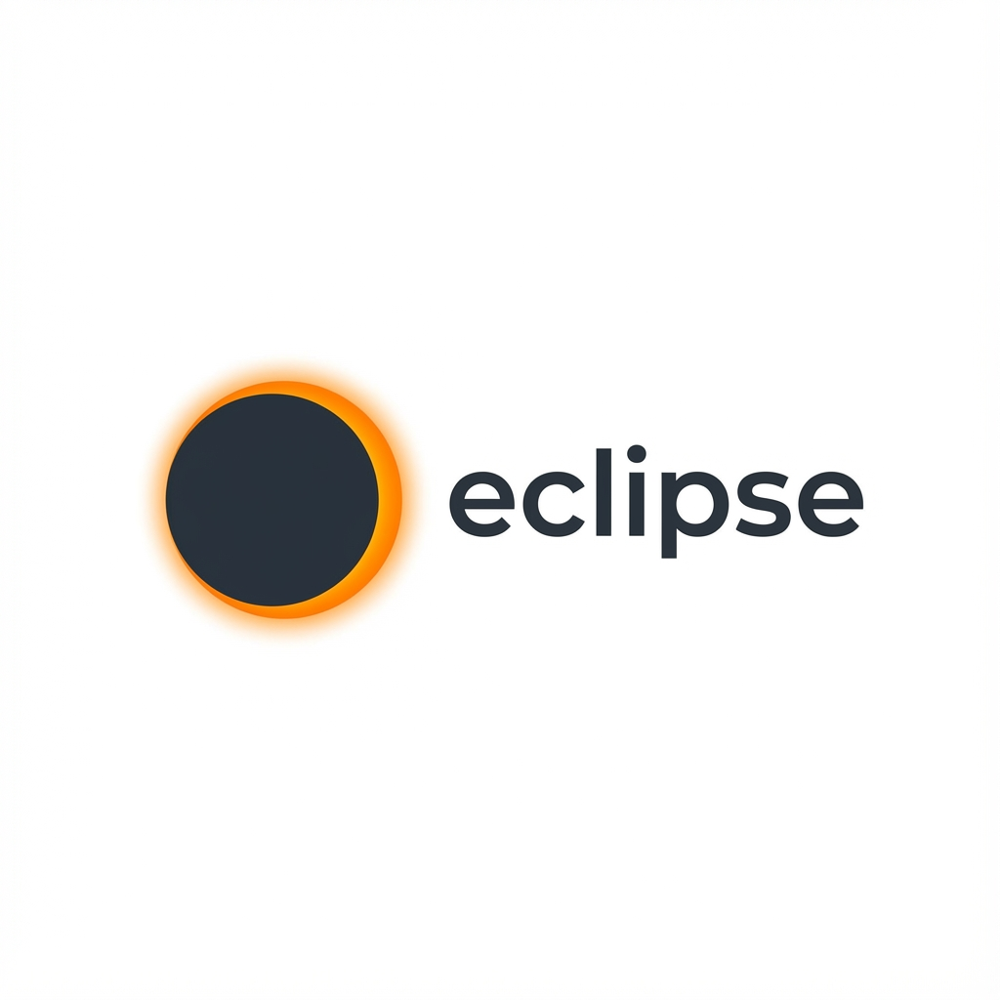

# Eclipse - Видеоплатформа нового поколения



**Eclipse** - это современная видеоплатформа, построенная на Next.js и Supabase, которая предоставляет полноценный функционал для просмотра, загрузки и управления видеоконтентом.

## 🚀 Особенности

- **📺 Просмотр видео**: Высококачественный видеоплеер с поддержкой различных форматов
- **📤 Загрузка контента**: Простая и быстрая загрузка видеофайлов
- **👥 Пользовательские каналы**: Создание и управление персональными каналами
- **📝 Система постов**: Публикация текстового контента и новостей
- **🔔 Подписки**: Следите за обновлениями любимых авторов
- **📊 История просмотра**: Отслеживайте просмотренный контент
- **⚙️ Настройки профиля**: Полная персонализация аккаунта
- **🔐 Безопасность**: Надежная аутентификация через Supabase

## 🛠 Технологии

- **Frontend**: Next.js 14 (App Router), TypeScript
- **UI/UX**: Tailwind CSS, современные компоненты
- **Backend**: Supabase (PostgreSQL, Authentication, Storage)
- **Стилизация**: PostCSS, globals.css
- **Линтер**: ESLint
- **Хранение**: IndexedDB для локального кэширования

## 📦 Установка и запуск

### Предварительные требования

- Node.js 18+ 
- npm/yarn/pnpm/bun
- Аккаунт Supabase

### 1. Клонирование репозитория

```bash
git clone https://github.com/ECL1PSE666/eclipse-beta-test.git
cd eclipse-beta-test
```

### 2. Установка зависимостей

```bash
npm install
# или
yarn install
# или
pnpm install
# или
bun install
```

### 3. Настройка Supabase

1. Создайте проект на [supabase.com](https://supabase.com)
2. Скопируйте URL и API ключи из настроек проекта
3. Выполните SQL скрипт из файла `supabase_setup.sql` в редакторе SQL
4. Создайте bucket для хранения видео с именем `videos`

### 4. Настройка переменных окружения

Создайте файл `.env.local` в корне проекта:

```env
NEXT_PUBLIC_SUPABASE_URL=ваш_supabase_url
NEXT_PUBLIC_SUPABASE_ANON_KEY=ваш_supabase_anon_key
```

### 5. Запуск проекта

```bash
npm run dev
# или
yarn dev
# или
pnpm dev
# или
bun dev
```

Откройте [http://localhost:3000](http://localhost:3000) в браузере.

## 🏗 Структура проекта

```
src/
├── app/                    # Next.js App Router
│   ├── channel/           # Страницы каналов
│   ├── history/           # История просмотра
│   ├── login/             # Авторизация
│   ├── manage/            # Управление контентом
│   ├── news/              # Новости
│   ├── posts/             # Посты
│   ├── register/          # Регистрация
│   ├── settings/          # Настройки
│   ├── subscriptions/     # Подписки
│   ├── upload/            # Загрузка видео
│   ├── watch/             # Просмотр видео
│   ├── globals.css        # Глобальные стили
│   ├── layout.tsx         # Основной layout
│   └── page.tsx           # Главная страница
├── components/            # React компоненты
│   ├── layout/           # Компоненты макета
│   └── ui/               # UI компоненты
└── lib/                   # Утилиты и библиотеки
    ├── auth.tsx           # Аутентификация
    ├── idb.ts             # IndexedDB
    ├── posts.tsx          # Работа с постами
    ├── supabase.ts        # Клиент Supabase
    ├── utils.ts           # Утилиты
    └── videos.tsx         # Работа с видео
```

## 🔧 Основные компоненты

### Видеоплеер
- Поддержка множественных форматов
- Адаптивный интерфейс
- Полноэкранный режим

### Система постов
- Создание и редактирование
- Поддержка медиаконтента
- Система тегов

### Пользовательские каналы
- Персонализация профиля
- Загрузка обложек
- Статистика канала

## 📊 База данных

Проект использует Supabase с PostgreSQL. Схема базы данных настраивается через `supabase_setup.sql` и включает:

- Таблицы пользователей
- Видео и метаданные
- Посты и комментарии  
- Подписки и лайки
- История просмотров

## 🚀 Деплой

### Vercel (рекомендуется)

[](https://vercel.com/new/clone?repository-url=https://github.com/ECL1PSE666/eclipse-beta-test)

1. Подключите GitHub репозиторий к Vercel
2. Настройте переменные окружения
3. Деплой произойдет автоматически

### Другие платформы

Проект совместим с любыми Next.js хостингами:
- Netlify
- Railway  
- DigitalOcean App Platform
- AWS Amplify

## 🤝 Вклад в проект

Мы приветствуем вклад в развитие Eclipse!

1. Форкните репозиторий
2. Создайте ветку для новой функции (`git checkout -b feature/AmazingFeature`)
3. Закоммитьте изменения (`git commit -m 'Add some AmazingFeature'`)
4. Отправьте в ветку (`git push origin feature/AmazingFeature`)
5. Откройте Pull Request

## 📝 Лицензия

Этот проект распространяется под лицензией MIT. Подробности в файле `LICENSE`.

## 👨‍💻 Автор

**ECL1PSE666** - *Разработчик Eclipse*

## 🙏 Благодарности

- Next.js команда за отличный фреймворк
- Supabase за мощную backend-платформу
- Vercel за удобный деплой

---

**Eclipse** - видеоплатформа будущего! 🌟
